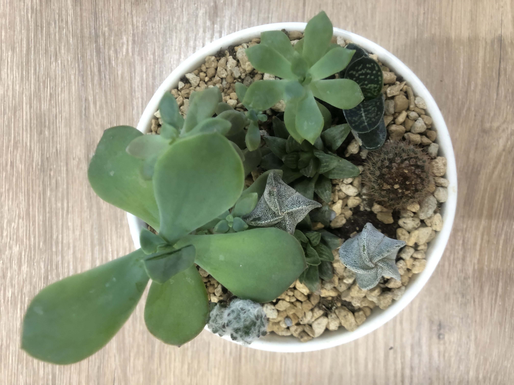

# 旅遊減碳

## 1. 標題1
段落文章A
- 子項目
- 兩個蟲蟲是~~刪除線~~
- 一個星號是*斜體字*
- 三個星號是***粗體加斜體***
- 要打底線為寫ins: <ins>打</ins>
- 若要保持星號則加back slash \* 才會出現 \*
- 想要強調某些字，採用類上引號式的`頓號`、才是`正解`
- 要上標打sup <sup>上標在這</sup>
- 要下標打sub <sub>下標在這</sub>
## 2. 標題2
段落文章B，想要換行，可以每行後面打兩個空格  
才會換行
## 3. 標題3
段落文章C，想要換行，可以每行後面打兩個空格，後再加enter一行，間距會變大  

才會換行  
## 4. 標題4
段落文章D，要打反斜線且結束不能空格\
才會換行
## 5. 標題5
段落文章E
```Python(這裡可以寫是甚麼語法的程式)
在這裡打三個類上引號式的`號，則此段可以供人複製
通常這裡常放程式
```
## 5. 標題6
以下為教超連結 []
